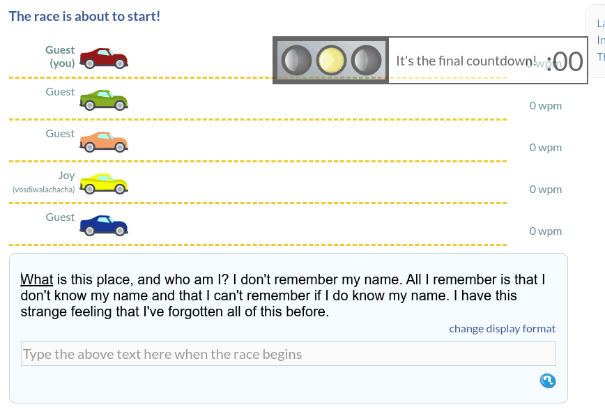

# TypeRacer-F1🏎️



🏎️ Autotyper for typeracer.com

# Disclamer⚠️

**This program is only for educational purposes and doesn't incite you to cheat.**

# Installation ⬇️

## Install npm and [nodejs](https://nodejs.org/en/) 

### Arch 🐧

```bash
sudo pacman -S npm nodejs
```

### Debian 🐧

```bash 
sudo apt install nodejs
```

### Windows 🪟 

Download and install nodejs from [here](https://archlinux.org/download/)

## Install modules

```bash
# 📂 TypeRacer-F1/
npm install
```

# Usage 🌟

In the terminal, run

```bash
# 📂 TypeRacer-F1/
node index.js
```

# SKIDS 👶

please don't copy this code or at least credit me 

# final

* If you have any probleme, don't hesitate to open an issue
* One of my similar project : [TenFastFingersBot](https://github.com/SkwalExe/TenFastFingersBot)

# contributing

Pull requests are welcome. For major changes, please open an issue first to discuss what you would like to change.        
   
<a href="https://github.com/SkwalExe#ukraine"></a>
